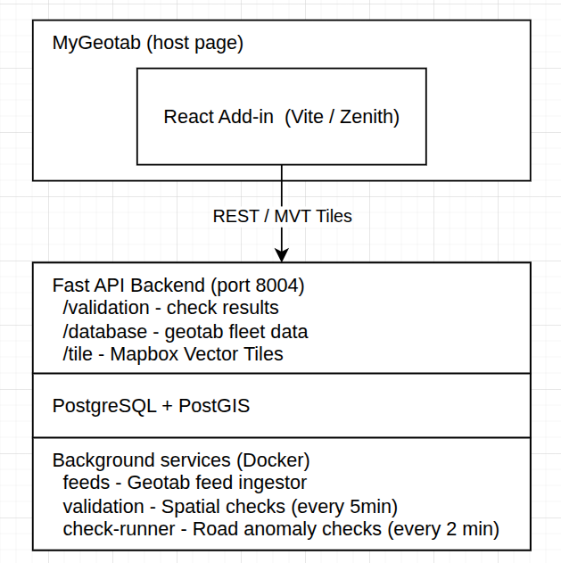

# Aspen GIS Geotab Add-in

A Geotab MyGeotab add-in for monitoring and validating GPS/telematics data quality across a fleet of vehicles. It cross-checks raw device data against road network geometry and historical baselines to surface anomalies, flag poor-quality data, and give fleet operators actionable per-vehicle insight.

---

## Key Features

- **Data Quality Dashboard** — fleet-wide overview of all vehicles with a health score per validation type, colour-coded by severity (good / warning / error).
- **Per-Vehicle Drill-down** — select any vehicle to see percentages for each check side-by-side with an interactive map and a detailed data table.
- **Six Validation Checks**
  | Check | What it detects |
  |---|---|
  | Teleportation | Impossible coordinate jumps between consecutive pings |
  | Distance to Road | GPS points mapped far from known road geometry |
  | Idle Outlier | Vehicles with abnormally long stationary periods |
  | Fuel Consumption | Fuel use deviating from the road-segment average |
  | Coolant Temperature | Engine temp outside the segment thermal baseline |
  | EV Battery Discharge | Energy depletion rate diverging from segment average |
- **Map Visualization** — MapLibre GL map with per-check MVT tile layers (anomaly dots, Overture road segments, teleportation paths).
- **Background Services** — continuous Geotab feed ingestion and automated validation runs that keep results fresh without manual triggers.
- **Auto-refresh UI** — validation and device data re-fetched every 10 seconds so the dashboard stays current.

---

## Architecture



---

## Geotab Data Ingestion

The backend continuously pulls two object types from the Geotab MyAdmin API via the **Geotab Data Feed**:

| Geotab Object | Description | Used for |
|---|---|---|
| `LogRecord` | Raw GPS latitude/longitude pings with timestamps, per device | Location storage, teleportation detection, distance-to-road checks |
| `StatusData` | Diagnostic readings (fuel level, coolant temperature, EV battery state, engine hours, etc.) tied to a device and timestamp | Road-counter checks (Fuel Consumption, Coolant Temp, EV Battery Discharge) |

The `feeds` background service polls the Geotab feed endpoints on a continuous loop and persists new records to the PostGIS database. The `validation` service then runs all checks against the accumulated data and writes per-device results to the `validation_results_by_device` table.

---

## Tech Stack

### Frontend (`add-in/app`)
| | |
|---|---|
| Framework | React 19 + TypeScript |
| Build tool | Vite 7 |
| UI library | @geotab/zenith |
| Data fetching | @tanstack/react-query |
| Map | react-map-gl + MapLibre GL |
| Geotab SDK | mg-api-js |
| Date handling | moment.js |

### Backend (`backend`)
| | |
|---|---|
| Framework | FastAPI |
| ORM | SQLAlchemy (async) |
| Database | PostgreSQL 16 + PostGIS 3.4 |
| Migrations | Alembic |
| Server | Uvicorn |
| Containerisation | Docker / Docker Compose |

---

## Getting Started

### Prerequisites

- Node.js 24 + Yarn 4
- Python 3.13+
- Docker & Docker Compose
- A MyGeotab account to load the add-in

---

### 1. Backend

```bash
cd backend

# Copy and configure environment variables
cp .env.example .env
# Edit .env — set DB credentials, Geotab credentials, ALLOWED_ORIGINS, etc.

# Start all services (DB, API, feed ingestor, validator, check-runner)
docker compose up --build

# Run database migrations (first time, or after pulling new migrations)
docker compose run --rm backend alembic upgrade head
```

The API will be available at **http://localhost:8004**  
Swagger docs: **http://localhost:8004/docs**

---

### 2. Frontend

```bash
cd add-in/app

# Install dependencies
yarn install

# Create a local env file and set the backend URL
echo "VITE_BASE_URL=http://localhost:8004" > .env.local

# Start the dev server
yarn dev
```

---

### 3. Load the Add-in in MyGeotab

1. Open MyGeotab → **Administration → System → System Settings → Add-ins**.
2. Click **Add** and paste the contents of `add-in/aspen-addin.json`.
3. Save. The add-in will appear in the left navigation.

---

## Deployment

### Backend — AWS EC2

The backend is deployed on an **AWS EC2 `xlarge` instance** running all Docker Compose services (API, database, feed ingestor, validator, check-runner).

- The FastAPI server is bound to a **custom domain** with **HTTPS** (TLS termination handled at the instance or via a reverse proxy such as Nginx).
- The `ALLOWED_ORIGINS` environment variable must include the AWS Amplify frontend domain so CORS requests are accepted.
- The `VITE_BASE_URL` in the frontend build must point to the EC2 HTTPS endpoint (e.g. `https://api.your-domain.com`).

### Frontend — AWS Amplify

The React add-in is a **single-page application** built into a static bundle and hosted on **AWS Amplify**.

```bash
# Build the production bundle
cd add-in/app
yarn build
# dist/ is then deployed via Amplify (CI/CD or manual drag-and-drop)
```

Amplify serves the bundle over HTTPS. The hosted URL is the one registered in the MyGeotab add-in manifest (`add-in/aspen-addin.json`) so MyGeotab can load the add-in inside its iframe.

---

## Development

```bash
# Lint frontend
cd add-in/app && yarn lint

# Generate a new DB migration
docker compose run -u $(id -u):$(id -g) --rm backend \
  alembic revision --autogenerate -m "your message"

# Apply / rollback migrations
docker compose run --rm backend alembic upgrade head
docker compose run --rm backend alembic downgrade -1
```
